<h1>Docker for beginners-Linux</h1>

<h2>#0 Prerequisites</h2>
clone repo dari github dengan nama linux_tweet_app pada akun dockersamples.

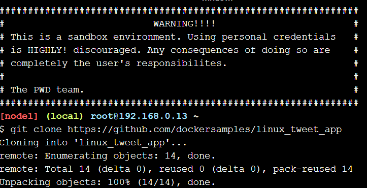

<h2>#1 Run some simple docker container</h2>

1. memulai dengan container image alpine

Output di bawah ini menunjukkan bahwa alpine: gambar terbaru tidak dapat ditemukan secara lokal. Ketika ini terjadi, Docker secara otomatis menariknya dari Docker Hub.
Setelah gambar ditarik, nama host kontainer ditampilkan dalam contoh di bawah.

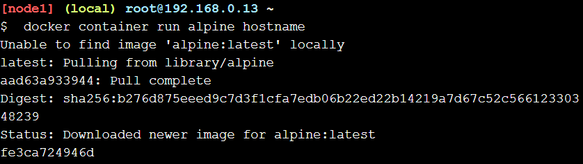

2. melihat semua daftar container

Dalam hal ini proses nama host keluar segera setelah output ditulis. Ini artinya wadah berhenti. Namun, Docker tidak menghapus sumber daya secara default, sehingga wadah masih ada dalam status Keluar.
untuk melihat list container maka perintah nya seperti gambar dibawah ini

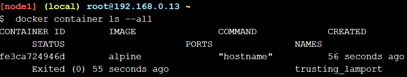

Wadah yang melakukan satu tugas dan kemudian keluar bisa sangat berguna. bisa membuat gambar Docker yang mengeksekusi skrip untuk mengkonfigurasi sesuatu. Siapa pun dapat menjalankan tugas itu hanya dengan menjalankan wadah - mereka tidak memerlukan skrip atau informasi konfigurasi yang sebenarnya.

3. Menjalankan Docker container dan mengakses terminal ubuntu

untuk menjalankan wadah Ubuntu Linux di atas host Alpine Linux Docker (Play With Docker menggunakan Alpine Linux untuk simpulnya).
Dua parameter pertama memungkinkan untuk berinteraksi dengan wadah Docker.
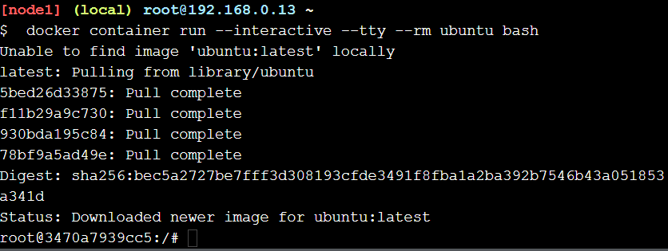

Ketika wadah mulai akan jatuh ke shell pesta dengan root prompt default  <id wadah>Docker telah menempel pada shell di wadah, menyampaikan input dan output antara sesi lokal dan sesi shell di wadah.

4. perintah seperti:

ls / akan mencantumkan isi direktur root dalam wadah, ps aux akan menunjukkan proses yang berjalan dalam wadah, cat / etc / issue akan menunjukkan distro Linux mana wadah berjalan, dalam hal ini Ubuntu 18.04.4 LTS.

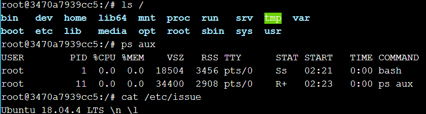

ketika ingin keluar dari ubuntu 18..04 LTS \n\1 maka bisa memencet ctrl+c, maka akan tampilan seperti gambar dibawah ini

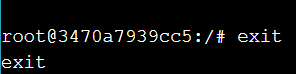

5. Cek versi host VM

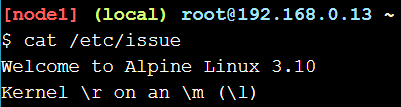

Perhatikan bahwa host VM kami menjalankan Alpine Linux, namun kami dapat menjalankan wadah Ubuntu. Seperti disebutkan sebelumnya, distribusi Linux di dalam wadah tidak perlu cocok dengan distribusi Linux yang berjalan di host Docker.

6. menjalankan MySQL container

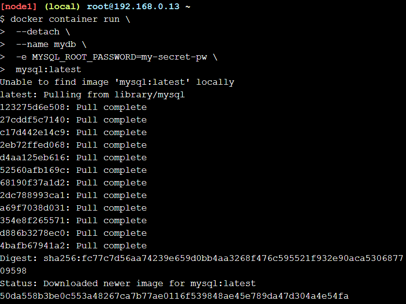

--detach akan menjalankan kontainer di latar belakang.

--name akan menamainya mydb.

-e akan menggunakan variabel lingkungan untuk menentukan kata sandi root (note: Ini tidak boleh dilakukan dalam produksi)

7. melihat daftar container

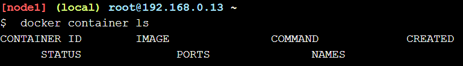

8. Cek log dan proses yang berjalan didalam container

memeriksa apa yang terjadi di wadah dengan menggunakan beberapa perintah Docker bawaan: log kontainer dan bagian atas wadah.

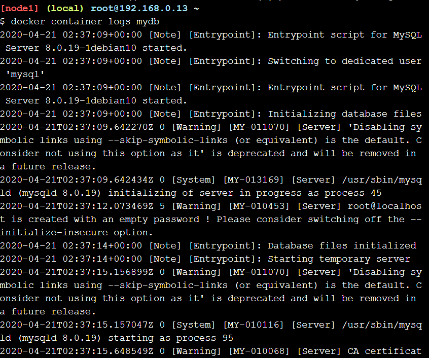

lihat proses yang berjalan di dalam wadah.

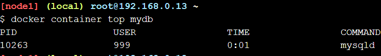

9. melihat versi MySQL yang digunakan

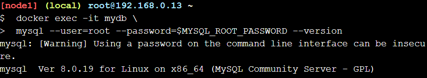

10. menghubungkan terminal ke sh

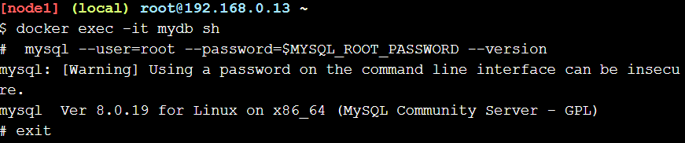

<h2>#2 package and run a custom app using docker</h2>
Membuat image sederhana

1. berpindah ke direktory repo yang telah diclone dan melihat isi dari Dockerfile

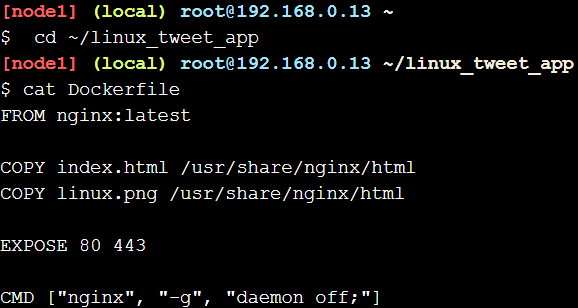

2. mengexport variabel dengan akun docker masing-masing

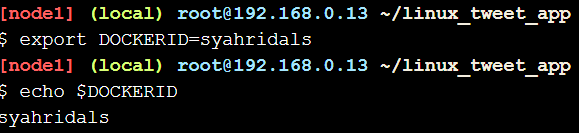

3. membuat docker image

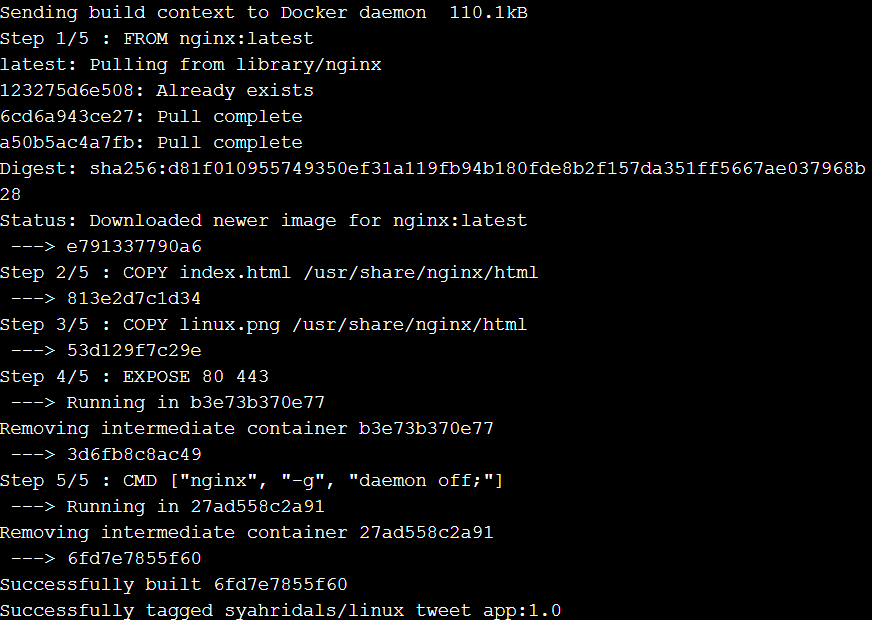

4. menjalankan container untuk menghosting image yang sebelumnya telah dibuat

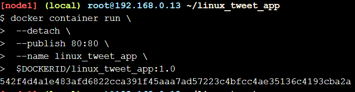

5. mengecek hasilnya dari link yang disediakan

 
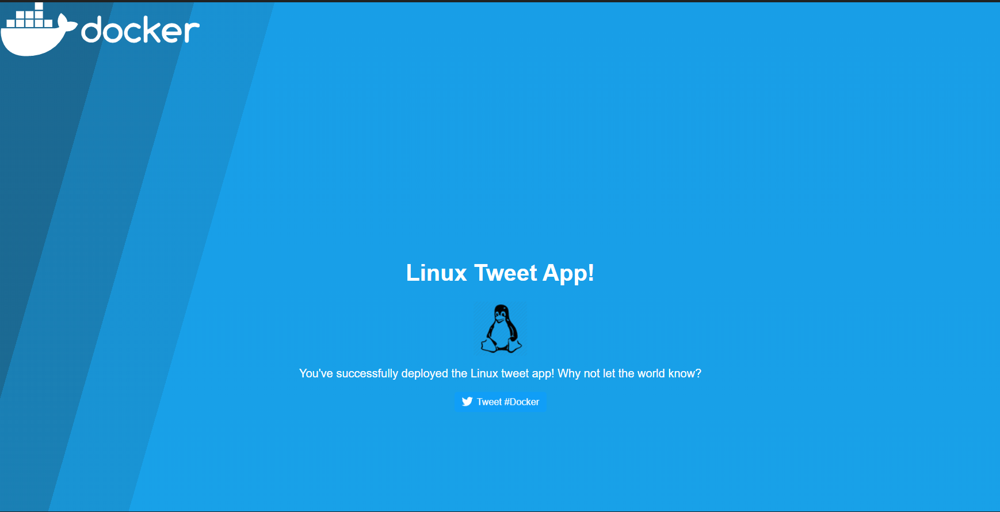

6. menghentikan dan menghapus container

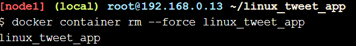

<h2>#3 modify a running website</h2>
Update the image

1. membuat image baru

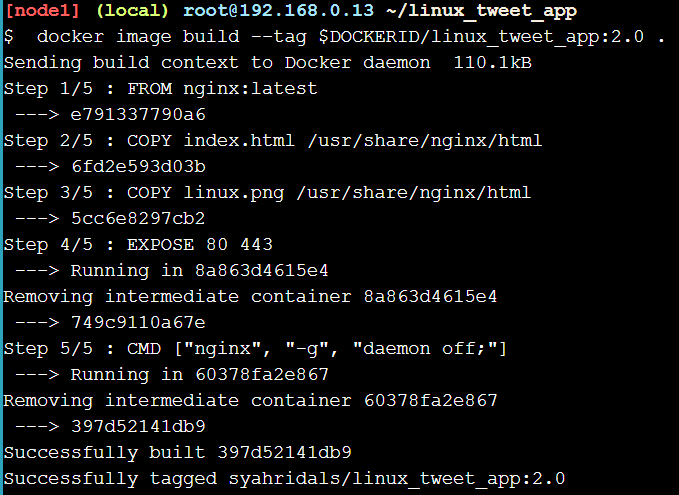

2. melihat daftar image yang ada

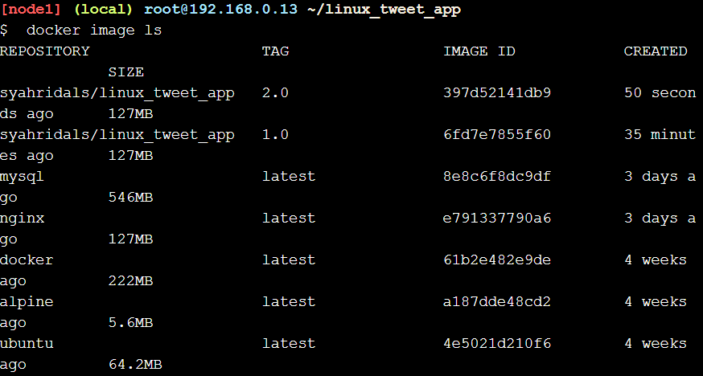

3. Login menggukan akun docker masing-masing agar dapat dipush ke akun docker kita

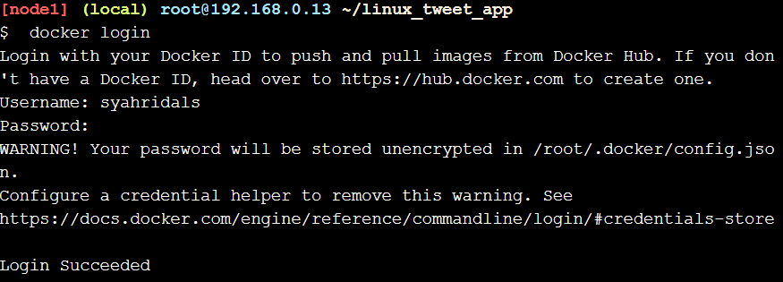

4. push image versi 1.0 dan 2.0

melihat progresnya ketika gambar didorong ke Docker Hub.

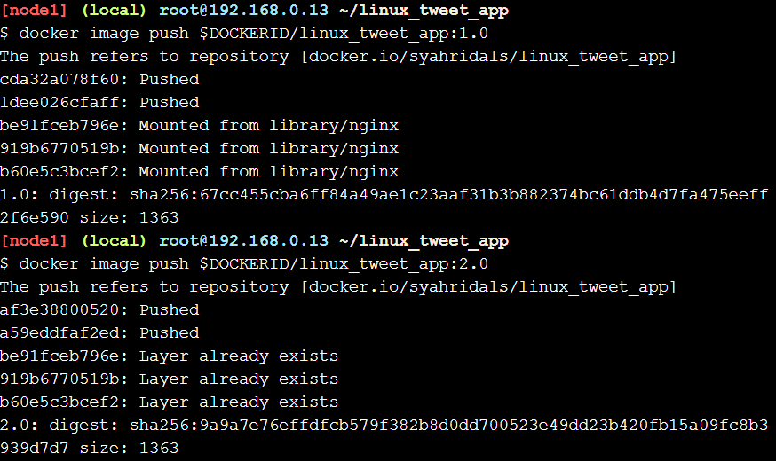

5. melihat hasil push di akun docker kita masing-masing

terlihat pada gambar dibawah ini container yang sudah dipush akan muncul pada akun docker kita masing-masing
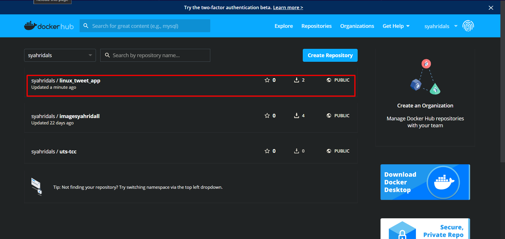