<h1>Application Containerization & Microservice Orchestration</h1>

<h2>Basic Link Extractor Script</h2>

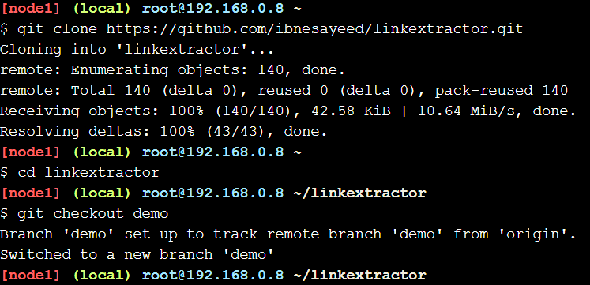

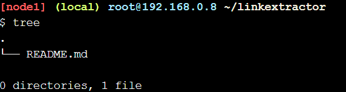

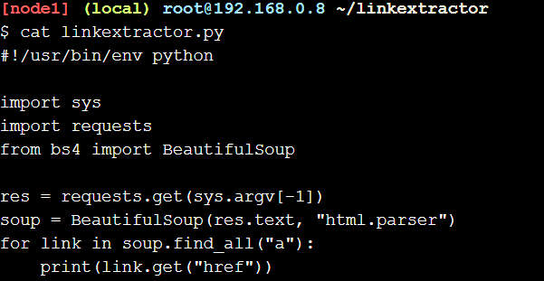

Ini adalah skrip Python sederhana yang mengimpor tiga paket: sys dari perpustakaan standar dan dua permintaan paket pihak ketiga yang populer dan bs4. Argumen baris perintah yang disediakan pengguna (yang diharapkan menjadi URL ke halaman HTML) digunakan untuk mengambil halaman menggunakan paket permintaan, kemudian diuraikan menggunakan BeautifulSoup. Objek yang diuraikan kemudian diiterasi untuk menemukan semua elemen jangkar (mis., Tag <a>) dan mencetak nilai atribut href mereka yang berisi hyperlink.

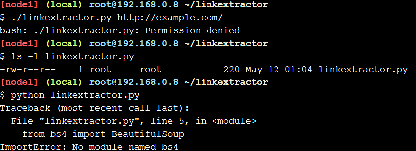

Izin saat ini -rw-r - r-- menunjukkan bahwa skrip tidak dapat dieksekusi. Kita dapat mengubahnya dengan menjalankan chmod a + x linkextractor.py atau menjalankannya sebagai program Python alih-alih skrip yang dijalankan sendiri seperti yang diilustrasikan di bawah ini:

<h2>Containerized Link Extractor Script</h2>

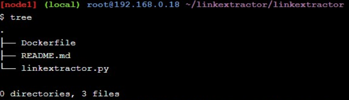
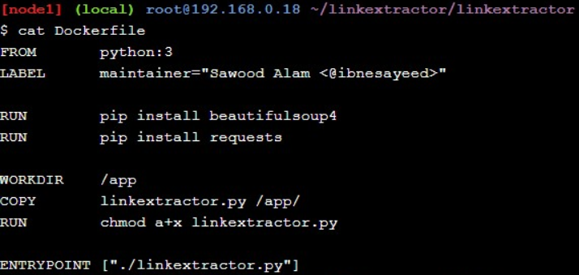

Dengan menggunakan Dockerfile ini, kita dapat menyiapkan gambar Docker untuk skrip ini.mulai dari gambar Python Docker resmi yang berisi lingkungan run-time Python serta alat yang diperlukan untuk menginstal paket dan dependensi Python.kemudian menambahkan beberapa metadata sebagai label (langkah ini tidak penting, tetapi merupakan praktik yang baik). Berikutnya dua instruksi jalankan perintah install pip untuk menginstal dua paket pihak ketiga yang diperlukan agar script berfungsi dengan baik.kemudian membuat direktori / aplikasi yang berfungsi, menyalin file linkextractor.py di dalamnya, dan mengubah izinnya untuk membuatnya menjadi skrip yang dapat dieksekusi. menetapkan skrip sebagai titik masuk untuk gambar

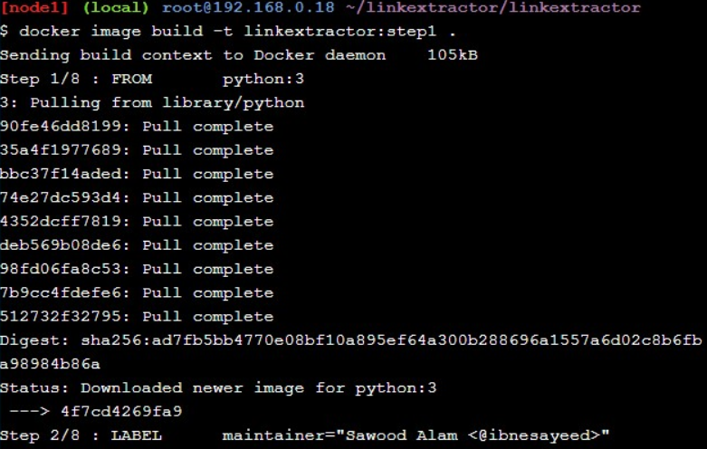
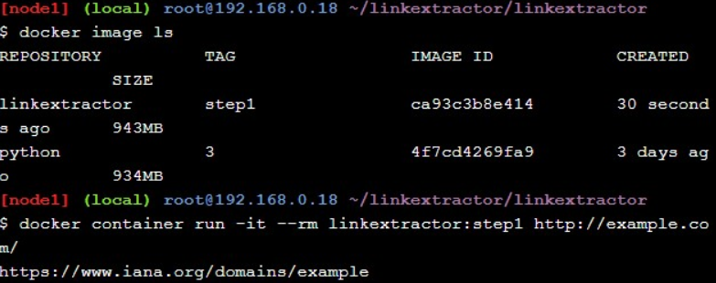
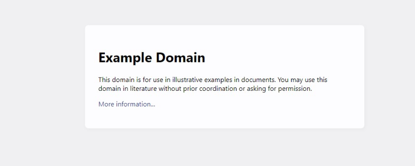

beberapa tautan bersifat relatif, kita dapat mengubahnya menjadi URL lengkap dan juga menyediakan teks jangkar yang ditautkannya. Pada langkah selanjutnya kita akan membuat perubahan ini dan beberapa perbaikan lainnya pada skrip.

<h2>Link Extractor Module with Full URI and Achor Text</h2>

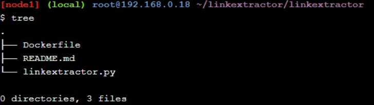
Pada langkah ini skrip linkextractor.py diperbarui dengan perubahan fungsional berikut:

jalur dinormalisasi ke URL lengkap, melaporkan tautan dan teks jangkar, dan dapat digunakan sebagai modul di skrip lain

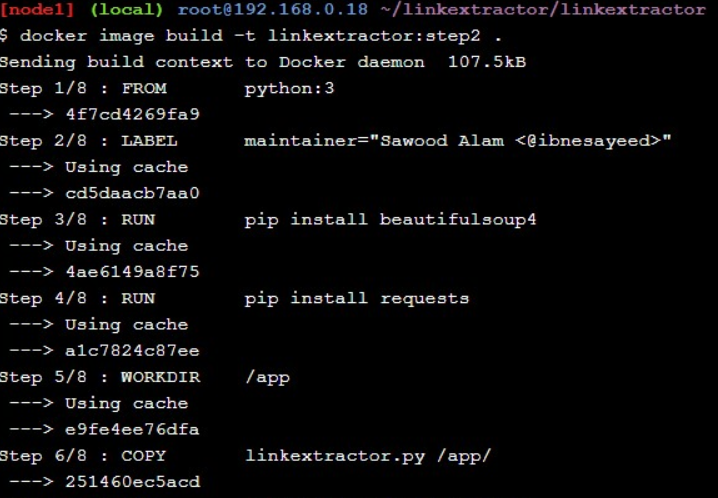
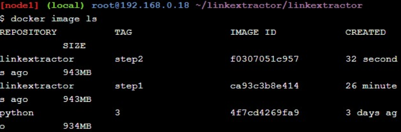
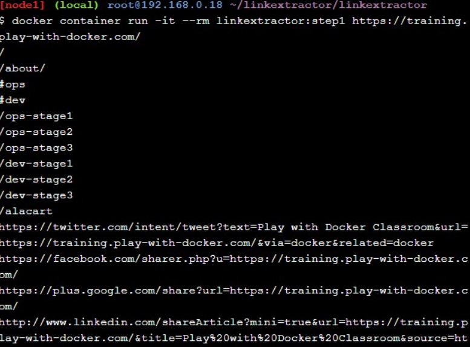
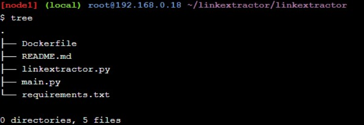

membuat wadah skrip dengan dependensi yang diperlukan untuk membuatnya lebih portabel. juga telah belajar cara membuat perubahan dalam aplikasi dan membangun berbagai varian gambar Docker yang dapat hidup berdampingan. pada langkah berikutnya kita akan membangun layanan web yang akan memanfaatkan skrip ini dan akan membuat layanan berjalan di dalam wadah Docker.

<h2> Link Extractor API Service</h2>

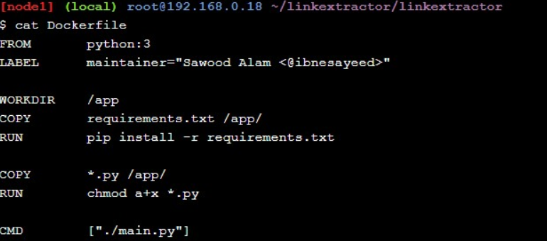

karena kita sudah mulai menggunakan requirement.txt untuk dependensi, kita tidak perlu lagi menjalankan perintah install pip untuk masing-masing paket. arahan ENTRYPOINT diganti dengan CMD dan mengacu pada skrip main.py yang memiliki kode server itu karena tidak ingin menggunakan gambar ini untuk perintah satu kali sekarang.

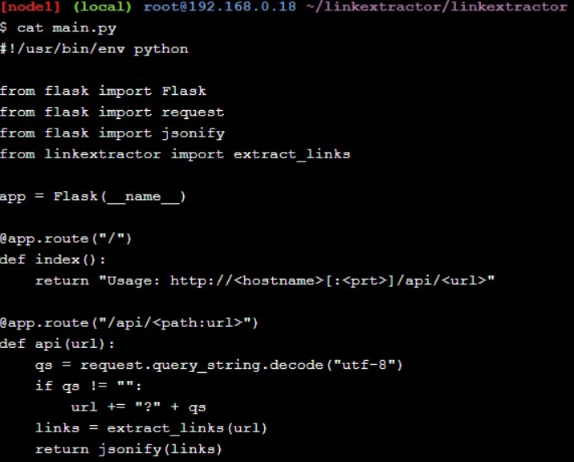
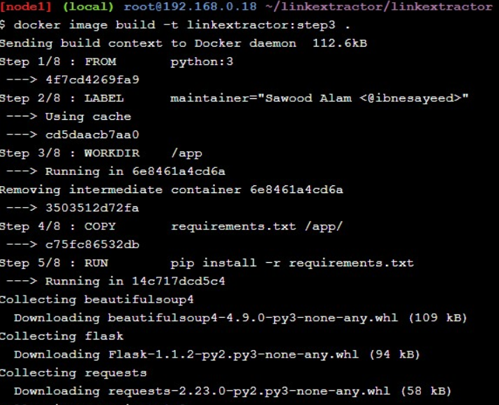

kemudian jalankan wadah dalam mode terlepas (-d flag) sehingga terminal tersedia untuk perintah lain saat wadah masih berjalan. perhatikan bahwa memetakan port 5000 dari wadah dengan 5000 host (menggunakan argumen -p 5000: 5000) agar dapat diakses dari host. menetapkan nama (--name = linkextractor) ke wadah untuk membuatnya lebih mudah untuk melihat log dan mematikan atau menghapus wadah.

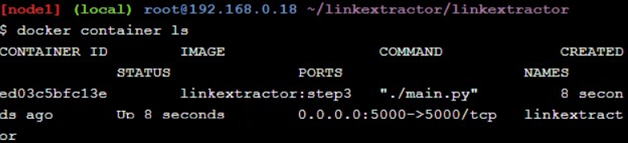
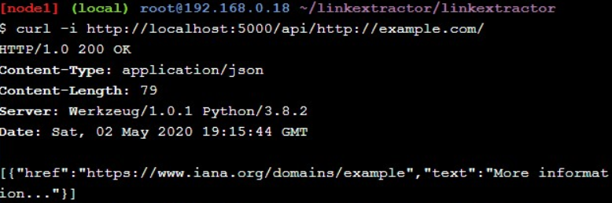
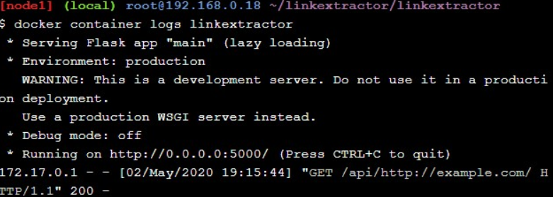

pada langkah ini telah berhasil menjalankan layanan API pada port 5000. tetapi tanggapan API dan JSON adalah untuk mesin, jadi pada langkah berikutnya akan menjalankan layanan web dengan antarmuka web yang di samping ini Layanan API.

<h2>Link Extractor API and Web Front End Service</h2>

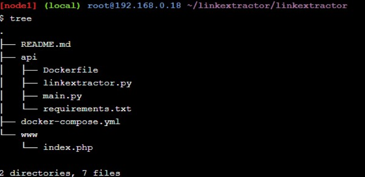
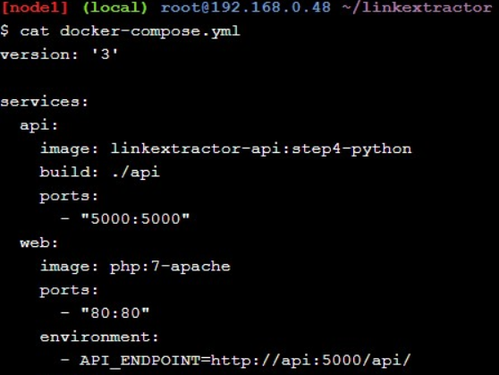
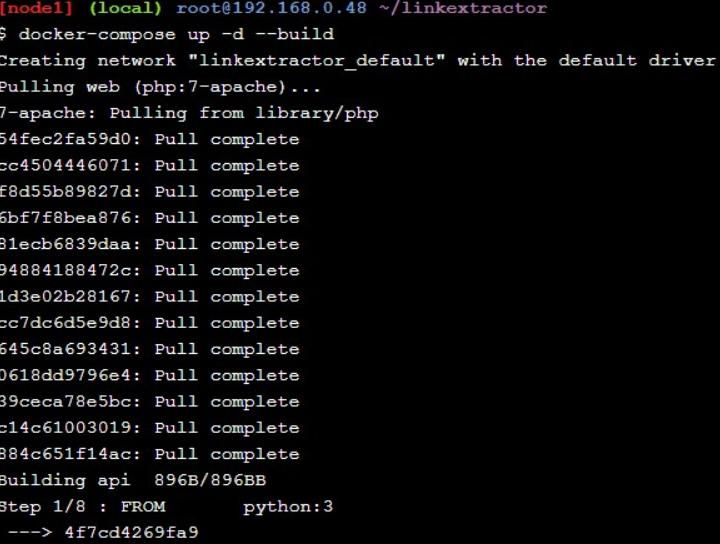
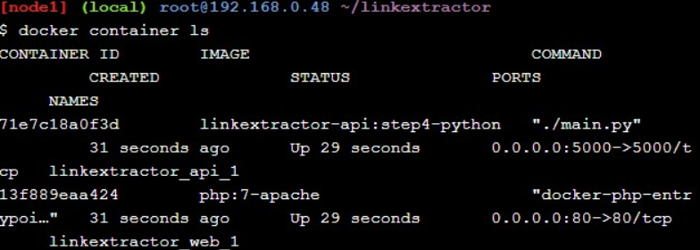
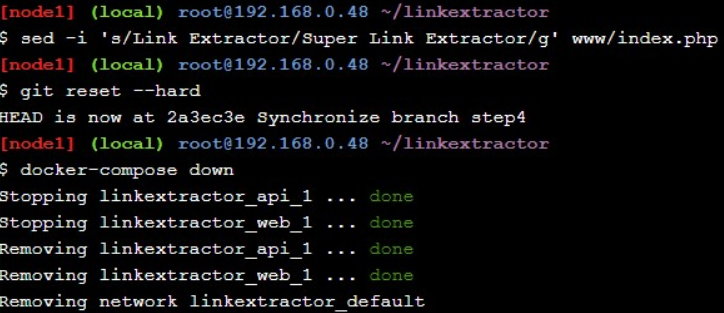

<h2> Redis Service for Caching</h2>

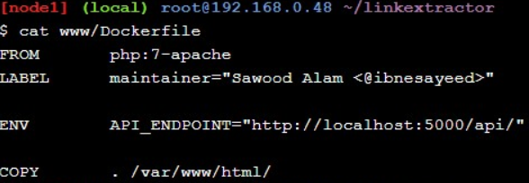
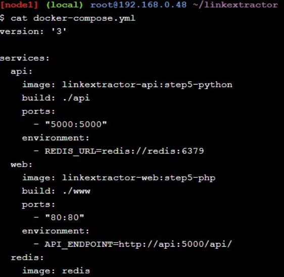
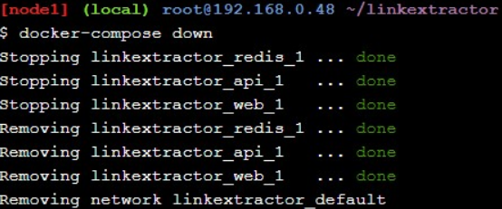

<h2>Swap Python API Service with Ruby</h2>

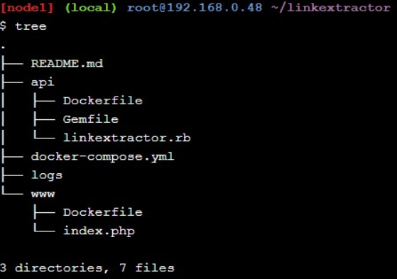
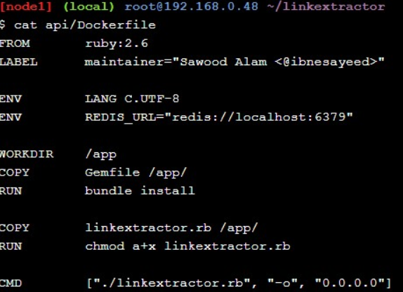
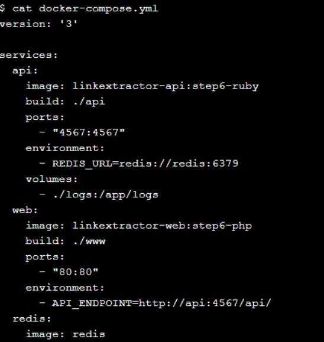
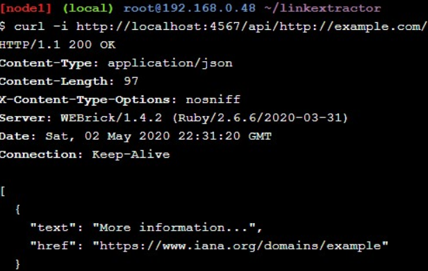
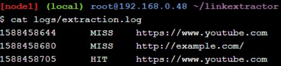
