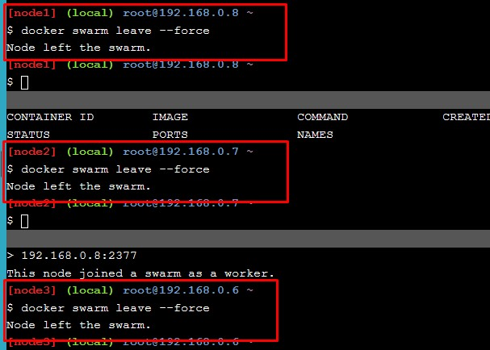

<h1>Docker Orchestration Hands-on Lab</h1>

1. Membuat container baru yang dijalankan pada node 1. Dengan menggunakan perintah seperti gambar dibawah ini : 
 
 
dimana dari perintah diatas tersebut berguna untuk membuat container baru. Container ini akan tetap berjalan pada background image docker saat sleep. 
2. Kemudian untuk mastikan bahwa container yang baru dibuat tersebut sudah berjalan pada node 1. Dengan menggunakan perintah seperti pada gambar dibawah ini : 
 
3. Kemudian menginisialisasi Swarm baru kemudian join dengan single node dan melakukan verifikasi apabila operasi berhasil. Dengan menggunakan perintah seperti gambar dibawah ini : 
 
 
Dimana dari hasil pembuatan docker swarm baru tersebut akan mendapatkan token yang nantinya digunakan untuk join node yang lain. 
Selanjutnya melakukan verifikasi pada node 1 apabila telah berhasil melakukan confogurasi manager node swarm. Dengan menjalankan perintah seperti gambar dibawah ini : 
 
4. Kemudian melakukan join swarm untuk node 2 dan node 3 dengan menggunakan token yang didapat dari pembauatan swarm baru sebelumnya. 
node 2 
 
node 3 
 
5. Setelah melakukan join node2 dan node3, kemudian kembali ke node1, dan jalankan perintah docker node ls untuk memverifikasi bahwa kedua node tersebut sudah join ke Swarm. Seperti pada gambar dibawah ini : 
 
 
6. Kemudian dari node 1 akan dilakukan deploy sleep pada docker swarm. Deploy Ini merupakan layanan dari docker swarm sendiri. 
 
Kemudian verifikasi bahwa pembuatan service telah diterima oleh Swarm manager. Seperti perintah dan hasilnya pada gambar dibawah ini : 
 
7. Kemudian melakukan replika pada container sampai sleep-app ke 7, ini berguna untuk mendeskripsikan container pada layanan service. Seperti pada perintah dan hasilnya pada gambar dibawah ini : 
 
 
Kemudian melihat replika container yang dibuat secara real-time.
 
 
 
Dimana dari hasil diatas terdapat 7 container yang berjalan.
8. Melakukan replika layanan kembali menjadi hanya 4 kontainer dengan melakukan pembaruan layanan docker container. Seperti pada perintah dan hasilnya dibawah ini : 
 
 
Dimana replika diatas sudah menghasilkan 4 container yang sedang berjalan. 
Kemudian melakukan verifikasi dari hasil replika container diatas, dengan menggunakan perintah seperti pada gambar dibawah ini : 
 
 
Sehingga dari hasilnya diatas, dimana terlihat hanya tinggal 4 container docker yang sendang berjalan pada slepp-app.
9. Kemudian mengecek status node yang sedang berjalan pada node 1. Dengan menggunakan perintah seperti pada gambar dibawah ini : 
 
 
10. Kemudian melihat container yang sedang berjalan pada node 2. 
 
11. Kemudian kembali ke node 1 untuk mengambil node 2 dari layanan service. Dengan menjalankan perintah seperti pada gambar dibawah ini : 
 
Dari hasil diatas, id node 2 akan digunakan untuk melakukan drain untuk menggantikan node kita dengan node 2. Seperti pada gambar dibawah ini : 
 
Setelah melakukan itu, maka cek satatus node, dengan menggunakan perintah seperti pada gambar dibawah ini : 
 
12. Kemudian kembali ke node 2, dan jalankan perintah seperti gambar dibawah ini : 
 
Sehingga hasilnya container pada node 2 sudah tidak berjalan lagi. 
13. Kemudian cek ulang pada node 1 bahwa container sudah dijadwal ulang, dengan melihat bahwa hanya ada 4 coinaer yang sedang berjalan sedangkan node 2 tidak. Seperti pada gambar dibawah ini : 
 
 
14. Kemudian menghapus layanan service pada node 1 dengan menggunakan perintah seperti dibawah ini : 
 
15. Kemudian menjalankan perintah docker ps pada node 1 untuk melihat daftar container yang sedang berjalan : 
 
dan kemudian melakukan kill container. Seperti pada gambar dibawah ini : 
 
16. Kemudian hapus semua swarm container untuk node 1, node 2 dan node 3 seperti pada gambar dibawah ini : 
 

