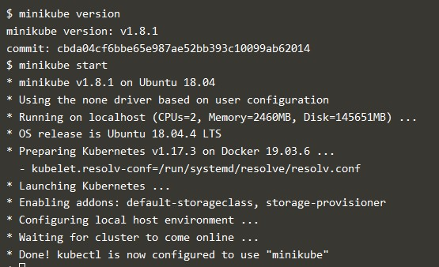
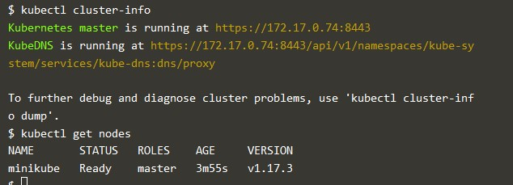
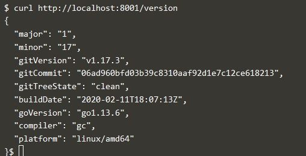
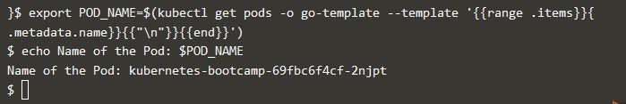
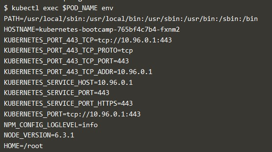
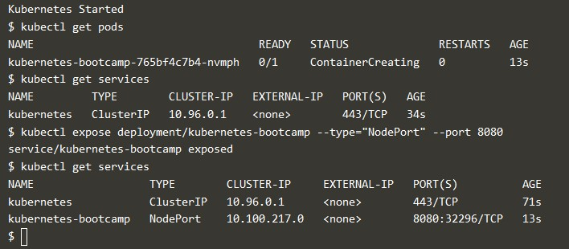

# Learn Kubertentes Basics.

1. Membuat cluster baru kubernetes. 
 
Dari gambar diatas dimana jika ingin membuat sebuah cluster kubernetes langkah pertama harus menjelankan minikube version. Selanjutnya baru menjalankan cluster kubernetes dengan minikube, perintahnya seperti gambar diatas.
2. Melihat versi cluster yang baru dibuat. 
 
3. Kemudian melihat detail cluster kubernetes yang dibuat dan melihat node dari cluster tersebut. 
 
4. Mendeploy app. 
Yang pertama perlu kita ketahui apakah kubectl terkonfigurasi dengan sluter kita atau tidak. 
 
5. Kemudian setelah itu menampilkan node dari cluster kita kembali. 
 
6. Kemudian melakukan deploy app kita dan melihat list hasil deploy app kita, dengan menjalankan perintah seperti dibawah ini. 
 
7. Kemudian membuka  halaman terminal baru untuk menjalankan server proxi. 
 
Dimana dari gambar diatas proxi kita berjalan pada host 127.0.0.1:8001 atau localhost:8001.
8. Selanjutnya melihat API yang dihosting pada server proxy kita dengan menggunakan versi API yang didapatkan yaitu curl. 
 
9. Kemudian membuat variabel POD_NAME untuk menyimpan nama POD kita. 
 
10. Explore aplikasi. 
Langkah pertama melakukan cek configurasi aplikasi kita yang sudah dideploy dan selanjutnya melihat deskripsi container dan image apa yang berjalan pada pod kita. 
 
11. Kemudian menjalankan kembali server proxi pada terminal baru. 
 
12. Kemudian kita akan mendapatkan nama Pod dengan merequest pod melalui proxy. 
 
13. Kemudian untuk melihat hasil aplikasi kita, perlu kita request ke curl dan mengambil log untuk container pod kita. 
 
14. Setelah pod aktif dan running, maka selanjutnya menjalankan perintah dengan menggunakan pod sebagai parameter pada container untuk membuat environment variabel. 
 
15. Selanjutnya memulai bash kita pada container pod kita dan sekaligus melakukan cek file yang menyimpan source code app NodeJS kita pada container. 
 
16. Selanjutnya melakukan cek curl apakah app kita berjalan didalamnya. Dan kemudian exit untuk keluar dari bash container. 
 
17. Membuat service baru. 
Langkah pertama melakukan cek configurasi aplikasi kita yang sudah dideploy, kemudian mendaftarkan/membuat service kita, kemudian deploy service kita dan melihat hasil deploy service kita. 
 
18. Selanjutnya melihat keseluruhan dari service kita. 
 
19. Selanjutnya membuat environment variabel dan disimpan pada node port dan melakukan cek curl apakah app kita berjalan didalamnya. 
 
20. Kemudian selanjutnya melihat label keseluruhan dari hasil deploy kita. 
 
21. Kemudian menjalankan pod kita dengan menggunakan parameter dari label pod kita, kemudian membuat nama pod pada environment variable POD_NAME serta membuat label baru. 
 
22. Kemudian melihat deskripsi dari pod sudah di label. 
 
 
23. Kemudian melihat daftar pod dengan menggunakan label baru kita. 
 
24. Kemudian menghapus service kita dan kemudian melihat kembali daftar service kita serta konfirmasi dari hasil romoved service kita. 
 
Dari hasil diatas dapat dipastikan app kita tidak dapat berjalan jika berada diluar cluster.
25. Untuk itu melakukan konfirmasi untuk mengetahui apakah app kita masih berjalan pada pod. 
 
26. Scalling a deployment. 
Langkah pertama dengan melihat list dari deploy kita, kemudian melihat replika set yang dibuat auto pada saat deploy, kemudian scale deploy kita untuk membuat 4 replika. Selanjutnya lihat kembali list deploy kita. 
 
27. Selanjutnya cek pada pod kita apakah terdapat perubahan pada nomor list pod kita. 
 
28. Kemudian melihat descripsi dari 4 replika pada hasil deploy scale kita. 
 
29. Selanjutnya melihat deskripsi service yang telah di load, Kemudian membuat kembali environment variabel dan disimpan pada NODE_PORT dengan nilainya yaitu node_port serta memastikan apakah NODE_PORT sedang berjalan atau tidak. 
 
30. Kemudian membuat scale down untuk service kita dengan membuat replika menjadi 2, kemudian melakukan cek perubahan dari hasil replika pada deploy kita dan kemudian cek status replika pada pod kita. 
 
dimana pada gambar status replika kita 2 diantaranya terminating menjadi layanan service.
31. Update App. 
Langkah pertama melihat list deploy dan kemudian melihat list pods kita. 
 
32. Selanjutnya melihat deskripsi pods kita. 
 
33. Kemudian update image kita dengan mendeploy name untuk image version baru kita dan kemudian melihat list pods kita kembali. 
 
34. Kemudian melakukan verifikasi hasil update kita dengan sebelumnya melihat deskripsi service kita. 
 
35. Kemudian membuat kembali environment variabel dan disimpan pada NODE_PORT dengan nilainya yaitu node_port serta memastikan apakah NODE_PORT sedang berjalan atau tidak dan melihat status deploy app kita sduah tersedia atau belum. 
 
36. Selanjutnya melihat deskripsi pods kita kembali. 
 
 
37. Kemudian melakukan deploy image yang sduah diupdate menjadi versi 10, selanjutnya melihat list dari hasil deploy image versi 10 tersebut, dan kemudian melakukan cek list untuk pods kita apakah terdapat perubahan atau tidak. 
 
38. Selanjutnya melihat deskripsi pods kita. 
 
Disitu masih terdapat warning error karena pods sebelumnya sudah di rollout. Sehingga harus undo rollout tersebut. Dan kemudian baru melakukan cek list pods kita kembali. 
 
39. Dan terakhir melihat deskripsi pods kita, untuk melihat perubahan pada pods kita. 
 
Sehingga hasilnya tidak terdapat warning error, dikarenakan rollout pada deploy kita sudah di undo.

